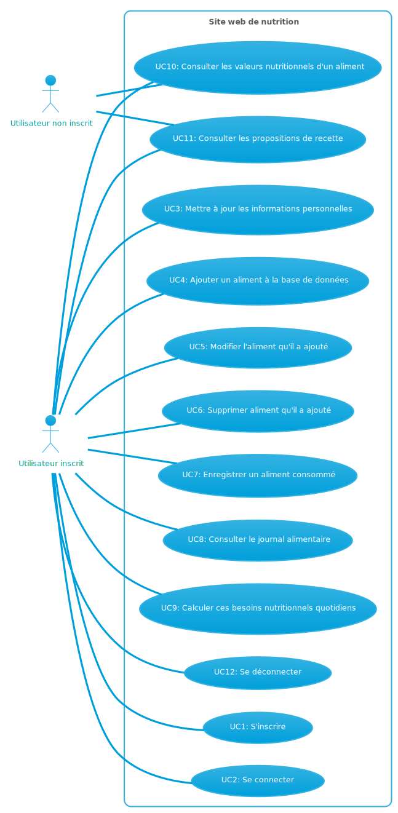

# EatTrack Web Application

Welcome to the official repository of the EatTrack web application. This is a comprehensive tool aimed at assisting users in tracking their daily nutritional intake, promoting a well-balanced diet through an interactive and user-friendly interface.

## 📝 Description

EatTrack provides an advanced daily requirement calculator that adjusts its recommendations based on a user's unique information, including weight, height, age, gender, and physical activity level. This personalized approach ensures a more accurate guideline for users to follow.

In addition, users can contribute to our expansive food database by adding new items. By recording the foods and respective quantities they've consumed, users maintain an accurate food journal that aids them in understanding their nutritional habits better.

With EatTrack, users have a powerful tool at their disposal for monitoring their diet, calculating their daily nutritional needs, and keeping track of their eating habits. All of these features promote informed decisions and healthy lifestyle choices.

## 🚀 Getting Started

Here's how you can set up EatTrack in your local environment.

### 📥 Installation and Setup

To start the server, execute:

```
npm run dev 
```
or

to build the project
```
npm run build
```

### ⚙️ Prerequisites

You need to have the following tools installed on your system:

- Node.js
- npm
- Next.js

To install all the dependencies, run:


```
npm install
```


## 🌐 Deployment

Our application is deployed on Vercel and is accessible at: [https://eattrack.vercel.app/](https://eattrack.vercel.app/)

## 🔧 Backend

Our backend is engineered using Node.js and Express.js.

The backend server is hosted on AWS EC2 and can be accessed at: [https://api.eattrack.net:8080/](https://api.eattrack.net:8080/)

## 🛠️ Technologies

EatTrack employs a range of modern technologies, including:

- Next.js
- React.js
- Node.js
- TypeScript
- Tailwind CSS
- Hot Toast
- React Hook Form
- React Icons
- NextAuth.js
- Swiper.js
- React Chartjs 2
- Axios

## 📊 Use Case Diagram (in French)



## 👨‍💻 Authors

Vincent Dubuc

## 📄 License

This project was developed for the 'Projet Web' course (Web Project) IG3 - Développement d'applications Web at Polytech Montpellier.

